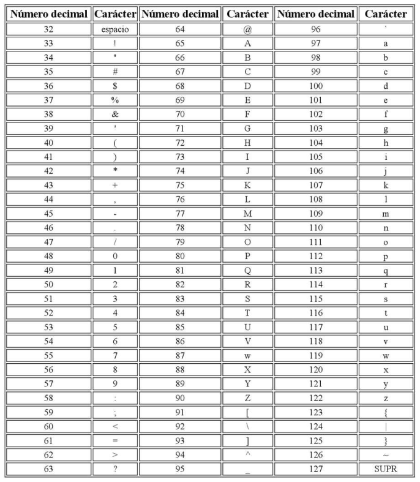

<head>
<SCRIPT TYPE="text/javascript">
  function popup(mylink, windowname) {
    if (! window.focus)return true;
    var href;
    if (typeof(mylink) == 'string') href=mylink;
    else href=mylink.href;
    window.open(href, windowname, 'width=440,height=300,scrollbars=yes');
    return false;
  }
</SCRIPT>
</head>

[](https://classroom.github.com/online_ide?assignment_repo_id=5312652&assignment_repo_type=AssignmentRepo)


# python: Primeros pasos

Introducción básica a **Python** y programas de prueba sencillos, para compartir con los alumnos y empezar con tareas de usar entornos de ejecución online, *notebooks*, GitHub y distintas clases de archivos.

Basic introduction to **Python** and simple test program to share with pupils to engage in accesing to online run environments, notebooks, Github, and different sort of files.
## Idea general de este curso

La computación abarca muchos campos de trabajo:
- Cómo se juntan varios elementos para formar un ordenadores.
- Instalar y configurar los sistemas operativos y los programas que funcionan sobre ellos.
- Conocer y usar aplicaciones para realizar el trabajo diario (edición de documentos, de fotografía o video, controlar el almacén de un negocio)
- Navegar y comunicarse en Internet: conocer las páginas web que nos proporcionan servicios y controlar nuestras cuentas de usuario en estas páginas.
- ...

No están reflejadas todas las posibilidades en esa lista. No hemos hablado de tareas como *crear páginas web*, *reparar y mantener un sistema automático* (por ejemplo, ascensores, puertas deslizantes, alarmas, ...), *almacenar y analizar grandes cantidades de datos* (para conocer la meteorología, para reconocer enfermedades a través de millones de radiografías, preferencias de compras de miles de usuarios, ...).

Todo esto que acabo de poner como ejemplos se resume simplemente en lo siguiente:

- Resolver problemas con herramientas de computación

Pero estas herramientas nos exigen todos esos campos de trabajo que hemos escrito en la primera lista.

## Documentos de profundización

* [Repositorios y **GitHub**](./repositorios_github.html)

* [Lenguajes](./lenguajes_programacion.html)

* <a href="./elementos_python.html" onClick="return popup(this, 'Elementos')">Python</a>

* [Intérpretes](#item3)

<a name="item1"></a>
## Repositorios y **GitHub**

Un repositorio es una carpeta en la que guardamos un proyecto, normalmente programas, y que debe estar sincronizada entre nuestro ordenador y los ordenadores de otros colaboradores.

**GitHub** es un sitio de Internet, que permite guardar repositorios. Es uno de los más utilizados del mundo.

Para sincronizar el trabajo que se hace, se utiliza un programa, **git**, que nos obliga a trabajar de una manera especial:
- Creamos copias del repositorio original, bien para tener una copia de nuestra propiedad, o bien para hacer una copia desde Internet a nuestro ordenador.
- Modificamos el programa en el que estamos trabajando, en una **rama** distinta, para que no se mezcle con lo que ya estaba hecho antes, y creamos una "*solicitud de incorporación*" (*pull request*), para que los colaboradores la prueben, y si el cambio está bien, se incorpora a la *rama* original.

<a name="item2"></a>
## Lenguajes

### Números binarios

Un ordenador trabaja con electricidad. Dentro, la parte más importante es el **microprocesador**. Tiene millones de circuitos electrónicos dentro. Está diseñado de manera que, uno tras otro, van pasando millonésimas de segundo en las que un cable enciende un voltaje y lo apaga, para que cada vez que se enciende, en un conjunto de cables *"pongamos"* encendidos o apagados los voltios, y según sea esta combinación de voltios, se lleven a esos circuitos electrónicos, y se produzca un resultado concreto, que aparece en forma de voltajes, encendidos o apagados, en ese mismo conjunto de cables.

Cada una de estas millonésimas de segundo está controlada por un circuito eléctrico que oscila rapidísimamente entre encendido y apagado. El circuito se llama ***reloj***, y cada oscilación es un ***ciclo de reloj***.

Para representar el voltaje encendido, se usa normalmente el número **1**, mientras que el apagado es el **0**. De esa manera, podríamos escribir los voltajes que van ocurriendo en cada instante de manera parecida a esta:

    00101001
    01001000
    00100101
    00100110
    11001010
    10010100
    10100100
    00101001
    00100011
    etc.

En esa lista de unos y ceros, unas líneas serían el voltaje que produce que el microprocesador se *configure* para realizar una operación u otra, y otras serían el voltaje que el microprocesador produce como resultado.

Es tremendamente difícil de leer, de modo que en primer lugar nos conviene separar esas líneas en dos, una para el voltaje que entra en el microprocesador, y otra para el voltaje que sale:

    Entrada:              Salida:

    00101001
    01001000
    00100101
                          00100110
    11001010
    10010100
    10100100
                          00101001
                          00100011

    etc.                  Etc.

La parte de *Entrada* es la que nos interesa aquí. Eso es un *programa*. Y al principio se escribían así. Hace ya más de 70 años. Y es tan complicado de entender, y puede provocar tantos errores de diseño, que ya desde el principio empezaron a usarse métodos para facilitar esto.

Esta forma de escribir ceros y unos es un sistema de escribir los números. En nuestro sistema decimal, empezamos con el cero para contar las unidades, usando un *dígito* que tiene un *dibujo* distinto para cada uno de los números, del cero al nueve. Pero cuando se nos acaban nuestros diez dibujos ya no podemos continuar con un solo dígito, Tenemos que usar otro: colocamos el *siguiente* dígito delante de una nueva serie de unidades. Se trata de las decenas. Ponemos el uno como decena, y empezamos otra vez las unidades por el cero.

Con los números binarios es igual, pero se nos acaban las unidades binarias antes. El cero es 0. Después viene el 1, y ya no podemos seguir, así que ponemos a la izquierda un 1 y a la derecha empezamos otra vez: 10, 11, y también hemos gastado los dígitos de la nueva columna de la izquierda. Seguiremos con 100, 101, 110, 111.

    Equivalencias entre decimal y binario:
        0       0               9     1001
        1       1              10     1010
        2      10              11     1011
        3      11              12     1100
        4     100              13     1101
        5     101              14     1110
        6     110              15     1111
        7     111              16    10000
        8    1000              17    10001    ...etc.

### El lenguaje *ensamblador*

Cuando un microprocesador recibe cierto número, hace una operación. Otro número, otra operación distinta. Y un microprocesador distinto normalmente tendrá para esas operaciones números distintos. Es una tarea muy muy difícil recordar qué operación hace cada número en cada microprocesador. Así que se asocia una operación con una abreviatura en letras:

    MOV      mueve un byte
    ADD      suma un byte a un registro de acumulación
    JMP      salta la posición del programa al siguiente datos

El cambio revolucionario que vino a continuación fue escribir un programa que, puesto en marcha, podía leer datos escritos en ensamblador, y convertirlos a los números correspondientes de manera automática, lo cual se conoce como ***lenguaje máquina***.

### Otros lenguajes clásicos
A partir de aquí, empezaron a aparecer lenguajes cada vez más sofisticados, que permitían representar los *algoritmos* matemáticos que resolvían distintos problemas, con unas palabras más parecidas al lenguaje humano.

Los primeros lenguajes fueron el **Fortran**, el **Algol**, **Lisp**, **Cobol**, **Basic**, el lenguaje **C** y el **Pascal**.

Los lenguajes se dividían en esa época en dos clases: los lenguajes ***compilados*** eran transformados por el programa que los leía en un bloque de números de *lenguaje máquina*. Los lenguajes ***interpretados*** eran puestos a funcionar por el programa intérprete mientras este programa leía los datos del texto del programa del lenguaje en cuestión.

Lenguajes compilados eran el **Basic** o el **Fortran**. Lenguajes compilados eran el **C** o el **Pascal**. Algunos de estos lenguajes se utilizan todavía en la actualidad.

Del lenguaje **C** derivan el lenguaje **C++**, el **C#**, y el **Java**. Posteriormente, con la aparición de Internet, se utilizaron extensamente (y todavía se usan en gran medida) lenguajes como **php*, **Perl**, **Javascript**, y los lenguajes de etiquetado para páginas web, **html**, **css**.

Resulta también importante el lenguaje más utilizado para consultar bases de datos, llamado **sql** (*Standard Query Language*)

#### Lenguajes actuales

**Java**, **Python** y **Javascript** están entre los más utilizados en la actualidad. Existen, sin embargo, multitud de lenguajes. Deben citarse **Ruby**, **Go**, **Swift**, **Kotlin**, **Scala** y **R**, aunque nos estamos dejando sin nombrar muchos otros.

Gran cantidad de los lenguajes, y esto se nota mucho en los actuales, se apoyan en lo que llamamos *bibliotecas (*library*) y *frameworks*. Las *bibliotecas* son fragmentos de programas que realizan trabajos típicos, necesarios con frecuencia, y que ahorran trabajo a los programadores. Los *frameworks* son conjuntos de librerías que facilitan también la escritura de programas, estableciendo una *manera* más o menos completa de diseñar estos programas.

Se entiende mejor con un ejemplo: Una *biblioteca* puede tener un trozo de programa para convertir una palabra en letras minúsculas a mayúsculas. Otra librería permite manejar motores con el ordenador.

Un *framework* puede estar destinado a ofrecer al programador un conjunto de trozos de programa para construir todos los elementos visuales de un programa (ventanas, botones, barras de desplazamiento, etc.) de manera homogénea, ahorrando todo el trabajo de diseño gráfico. *Frameworks* usados en la actualidad son **Django**, **React**, **Vue.js**, **Unity** o **Qt**. Existen muchos más, desde luego.

### Entorno de desarrollo Integrado (IDE)

Un **IDE** es un programa que facilita escribir programas. Los *IDEs* actuales hacen que el programa que estamos escribiendo -lo que se llama **código fuente**- se vea claramente en pantalla, de manera *resaltada* (colores, principalmente). Tienen también detectores de errores, y menúes o botones para convertir el *código fuente* a *lenguaje máquina* o para *ejecutar* el código si debe interpretarse. Gestionan también los distintos archivos que forman parte de todos los programas de nuestro proyecto.

Son *IDEs* ampliamente usados: **IntelliJ**, **Visual Studio Code**, **Eclipse**, **Atom**, **NetBeans**, **XCode** o **PyCharm**.

Algunos *IDE* sirven para programar en un lenguaje específico. Otros sirven para distintos lenguajes.

### Códigos.

#### Hexadecimal
La primera simplificación del sistema numérico ***binario*** es reducir cada ***palabra*** de ocho dígitos a una reducción más fácil de leer. Se trata del código ***hexadecimal***. Cada grupo de cuatro unos y ceros se puede representar con un *carácter* o *dígito* de un conjunto de 16 diferentes. Como nuestro sistema decimal numérico solamente tiene 10, lo que se hace es usar esos 10 y añadir 6 letras. Así, el grupo de voltajes 0000 representaría al número cero, y usamos ese número cero como abreviatura. El 0001 pasará a ser el número 1, y el 0010 (que es el siguiente contando en el sistema binario) será el 2, y así hasta llegar al 1001 que es el 9. El siguiente, 1010 será la letra A, el 1011 será la B, y el último, 1111 es la F.

Un ejemplo de programa ahora resultará más fácil de leer:

    ...
    23
    25
    33
    3A
    B1
    B3
    44
    etc.

Pero no es más fácil de entender. Para eso tendremos que conocer qué obliga a hacer cada número en el microprocesador. Por ejemplo podría ocurrir que el número 33 conectara los circuitos del microprocesador para leer los dos siguientes datos y sumarlos. Así, los siguientes (3A y B1) no hacen nada, son solamente los números que hay que sumar. Pero también podría ser que el número 23 que hay antes sea la instrucción de multiplicar, y entonces los dos siguientes son los números, y el 33 es un número para multiplicar y no una instrucción. Hay que diferenciar de alguna manera lo que son ***instrucciones*** y lo que son ***datos***.

#### Ascii

 En los ordenadores es casi inevitable que tengamos que guardar datos. Y es muy frecuente que se trate de documentos, que contienen texto. Por ejemplo, este documento que estás leyendo.

 En los primeros años se utilizó extensamente el código ***Ascii*** para esta tarea. En este código se hace una equivalencia entre los números binarios que representan el voltaje en el ordenador con las letras, símbolos y números necesarios para escribir texto.

 

Esta tabla muestra solo los caracteres que se pueden imprimir. Hay otros (del cero al 31) que son códigos de control, como el *retorno de carro*, el *fin de línea*, *retroceso*, etc.

En la actualidad se usan otros conjuntos de códigos, que incluyen muchas más letras, que son necesarias en distintos idiomas. Se trata de los códigos **utf**, y otros. Estos códigos utilizan varios grupos de 8 unos y ceros para cada *carácter*.

#### Bits, bytes, números enteros y caracteres.

Un ***bit*** es la cantidad más pequeña posible de información. Es la respuesta más corta que se puede dar a una pregunta sencilla. Es **sí** o **no**. ¿La luz está encendida? Solamente puede haber dos posibilidades: o está encendida o no lo está.

Los *bits* se representan con un sistema numérico binario: 0 y 1. Al usar este código en un ordenador, un cable puede tener el voltaje encendido o apagado. Se diseñan los ordenadores para que no puedan tener el voltaje a medio encender, porque si no, no podrían hacerse los cálculos usando el lenguaje binario.

Los *bits* se agrupan en conjuntos. Hay conjuntos de cuatro, pero son poco útiles, y grupos de ocho. Un grupo de 8 *bits* recibe el nombre de ***byte***. Durante muchos años los ordenadores se diseñaron para utilizar *bytes* como unidad básica que se operaba de una vez. Esto significa que la cantidad de cables de datos era de 8. El microprocesador tenía 8 *pines* o *patillas* de datos para conectarse a la placa base.

Con 1 *byte*, es decir, 8 *bits*, pueden manejarse números que van desde el 0 hasta el 255. De una tacada. O sea, con un solo *ciclo de reloj* del microprocesador.

Pero no es suficiente. Necesitamos hacer operaciones con números más grandes. Y esto implica que tendremos que utilizar *más bytes* para representar números. Los **números enteros** suelen utilizar 4 *bytes*. Y eso implica, a su vez, que los microprocesadores tendrán que gastar *más ciclos de reloj* para realizar sumas, restas o multiplicaciones con números enteros.

Un ***carácter*** es una *letra* o similar (signos de sumar, mayor que, corchetes, el punto, la coma, el espacio, y los *dibujos* de los números, etc.). Utilizando el código Ascii, un carácter se puede guardar dentro de un único *byte*.

A partir de la década de 1980 se comenzaron a fabricar microprocesadores más grandes, rápidos y potentes, que podían manejar de golpe 16 *bits*, y pocos años después, 32. En la actualidad, la mayoría de los ordenadores existentes son de 64 *bits*.

<a name="item3"></a>
## Python

Es un lenguaje de programación inventado en 1991, tras varios años de diseño. Se trata de un lenguaje *interpretado*.

Resulta sencillo de aprender, porque sus normas sintácticas evitan el uso de gran cantidad de símbolos. Por ejemplo, en lenguaje **C**, cada instrucción *debe terminar* con punto y coma (;). En Python no se usa esta norma. Algunos lenguajes no obligan a escribir claramente qué trozos de programa están dentro de otros, pero **Python** obliga a esto, con lo cual se lee mejor el *código fuente*.

### Elementos de un lenguaje de programación

#### Palabras reservadas

Todos los lenguajes utilizan una serie de palabras para dirigir lo que hace el programa.

En lenguaje **Python** algunas de estas palabras son **for**, **if**, **while**, **import**, **return**, **in** o **break**. En total hay treinta y tres. Estas palabras solamente pueden usarse para la tarea que diseñaron los creadores del lenguaje.

#### Operadores

Son símbolos especiales para hacer operaciones con datos. Los más comunes son **+**, **-**, **\***, **/**, **<**, **>**, o **%**.

Hay operadores matemáticos, como sumar o restar, y otros de comparación (mayor que y menor que). Otros comparadores son lógicos, y en Python se utilizan las palabras reservadas **and**, **or** y **not** para ello. Por último, existen los comparadores de *asignación*, como el signo **=**, que permite transferir un valor a una *variable*.

#### Variables

Una variable es un espacio que reservamos en la memoria del ordenador para guardar datos. A ese espacio le damos un nombre para poder usarlo en el programa. El nombre no puede ser una palabra reservada.

Lo que guardamos dentro de la variable, podemos ir cambiándolo mientras el programa funciona.

Hay varios tipos de datos: **letras**, **palabras y frases**, **números enteros**, **números decimales**, y **combinaciones de ellos**.

para crear una variable, basta con escribir su nombre y asignarle un valor. Esto es distinto de otros lenguajes, ya que los otros nos piden decir qué tipo de variable queremos, antes de usarla.

```python
animal = "vaca"
```
Esta variable es de tipo **String**, es decir, *cadena de texto*. Debemos encerrar el contenido entre comillas. Pueden ser comillas sencillas, triples sencillas, o comillas dobles. El signo *=* hace que la cadena **"vaca"** se almacene dentro de la memoria del ordenador, y le pone la etiqueta **"animal"** a ese espacio de memoria, para que después podamos recuperar la cadena.

Con estas variables podemos hacer diversas cosas. Entre ellas, mostrar mensajes a los usuarios. Se puede operar con las cadenas de texto: unirlas, buscar parte de su contenido, dividirlas, etc.

En **Python** se puede cambiar el tipo de variable sobre la marcha:
```python
animal = 7
```
Ahora *animal* ya no es una cadena, sino un número entero, y, por lo tanto, las operaciones que se pueden hacer son distintas.

Esta cualidad de **Python** simplifica la escritura de programas sencillos, pero suele ser también fuente de frecuentes errores, si planificamos hacer alguna operación con una variable que originalmente era de un tipo, pero que después tiene otro distinto:

```python
animal = 6
print(animal+1)
#  Aquí podrían venir muchas líneas de programa.
animal = "vaca"  #Esta línea puede ser una modificación
                 #que hemos hecho después, y que está
                 #rodeada de mucho programa antes del error.
#  Aquí podría haber muchas líneas más.
print(animal+1)
```
Resultado:
> 6
>
>---------------------------------------------------------------------------
/var/folders/k8/l3stnc1x1m5dhncb6mc96h9h0000gn/T/ipykernel_17651/3099013040.py in <module>
>      6                  #rodeada de mucho programa antes del error.
>      7 #  Aquí podrían muchas líneas más de programa.
>----> 8 print(animal+1)
>
>TypeError: can only concatenate str (not "int") to str

Puedes continuar este apartado por tu cuenta, pinchando en el enlace siguiente:

[Contenidos y ejercicios de un curso](https://colab.research.google.com/github/institutohumai/cursos-python/blob/master/Introduccion/1_TiposDatos/tipos-datos.ipynb)

##### Indentación

Indentación es el truco de mover el texto hacia la derecha para que se entienda mejor el programa. En la práctica totalidad de los lenguajes, es algo que todo programador hace para ver claramente cosas como repeticiones, o qué trozos pertenecen a un bloque. **En Python es obligatoria**. Hay que usar cuatro espacios para que una línea pertenezca a un trozo que se repite, y la primera linea que da comienzo al bloque, debe terminar con dos puntos (:)

Estos bloques se usan para controlar el flujo del programa, es decir, lo que hay que repetir, o lo que hay que hacer si se cumple una condición, o trozos que queremos reutilizar en lugar de copiarlos una y otra vez.

#### Listas

Una lista es un tipo especial de variable, que guarda varios datos, en lugar de uno solo. Cada dato tiene un índice, que sirve para poder acceder a leer o cambiar el contenido de ese dato. Las listas se crean usando *corchetes* [].
```python
colores = ['rojo', 'azul', 'verde', 'amarillo', 'violeta', 'naranja']
print(colores[2])
```
> verde

#### Funciones

Una función es una sección de un programa, que realiza una tarea de manera independiente al resto del programa.

La ventaja de usar una función es que ese fragmento se puede utilizar en distintas partes del programa y no es necesario volver a escribirlo. Conseguimos más facilidad de lectura y reducimos la posibilidad de error.

Para crear una función se utiliza la palabra reservada **def**.
