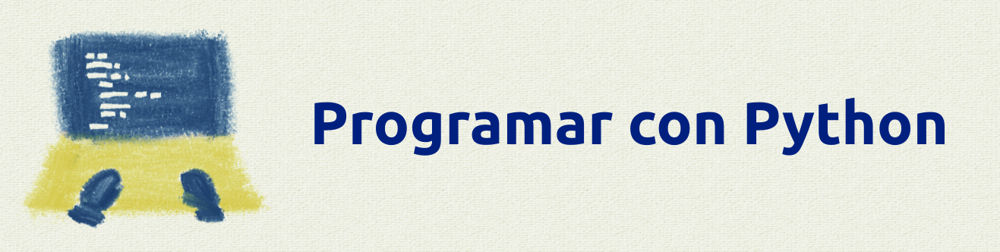

<head>

</head>

# python: Primeros pasos <a href="https://drancope-clases.github.io/programar-con-python-drancope/README.html" onClick="return popup(this, 'Elementos')">Versión webpage</a>

Introducción básica a **Python** y programas de prueba sencillos, para compartir con los alumnos y empezar con tareas de usar entornos de ejecución online, *notebooks*, GitHub y distintas clases de archivos y programas que necesitarán en sus tareas.

Basic introduction to **Python** and simple test programs to share with pupils to engage in accesing to online run environments, notebooks, Github, and different sort of files and programs that will be needed in their tasks.

## Idea general de este curso

#### Pensamiento computacional.

La computación abarca muchos campos de trabajo:
- Cómo se juntan varios elementos para formar un ordenadores.
- Instalar y configurar los sistemas operativos y los programas que funcionan sobre ellos.
- Conocer y usar aplicaciones para realizar el trabajo diario (edición de documentos, de fotografía o video, controlar el almacén de un negocio)
- Navegar y comunicarse en Internet: conocer las páginas web que nos proporcionan servicios y controlar nuestras cuentas de usuario en estas páginas.
- ...

No están reflejadas todas las posibilidades en esa lista. No hemos hablado de tareas como *crear páginas web*, *reparar y mantener un sistema automático* (por ejemplo, ascensores, puertas deslizantes, alarmas, ...), *almacenar y analizar grandes cantidades de datos* (para conocer la meteorología, para reconocer enfermedades a través de millones de radiografías, preferencias de compras de miles de usuarios, ...).

Todo esto que acabo de poner como ejemplos se resume simplemente en lo siguiente:

- Resolver problemas con herramientas de computación

Pero para usar estas herramientas tenemos que conocer mucho de todos esos campos de trabajo que hemos escrito en la primera lista.

Y además de conocer los programas que utilizaremos, de conocer nuestro Sistema Operativo (y otros), y no tener miedo de instalar, quitar y configurar programas, de usar Internet para buscar información, ayuda, y crear nuestra red de colaboradores, ...

...**la programación nos exige pensar de una manera especial, de ser capaces de convertir un problema en una secuencia de pasos ordenados, más parecido a como funciona los ordenadores, que suele conocerse como** ***pensamiento computacional***.

#### Plan de trabajo.

<a href="https://drancope-clases.github.io/programar-con-python-drancope/recomendaciones.html" onClick="return popup(this, 'Elementos')">Recomendaciones</a>

Algunos de los siguientes enlaces son "*notebooks*". Se trata de documentos interactivos para abrirlos con un servidor de notebooks, como [**Jupyter**](https://jupyter.org). Una forma de instalar **Jupyter**, con todas las cosas que necesita (especialmente, Python) puede ser descargar [**Anaconda**](https://www.anaconda.com/products/individual) en su versión *individual*, que trae además un montón de añadidos que pueden hacernos falta, y encima los maneja en un entorno de ejecución cerrado, para que no interfieran con otros programas de nuestro ordenador. También podemos usar un servidor online.

## Documentos de profundización

* <a href="https://drancope-clases.github.io/programar-con-python-drancope/repositorios_github.html" onClick="return popup(this, 'Elementos')">Repositorios y <b>GitHub</b></a>

* <a href="https://drancope-clases.github.io/programar-con-python-drancope/lenguajes_programacion.html" onClick="return popup(this, 'Elementos')">Lenguajes de programación</a>

* <a href="https://drancope-clases.github.io/programar-con-python-drancope/elementos_python.html" onClick="return popup(this, 'Elementos')">Python</a>

* <a href="https://drancope-clases.github.io/programar-con-python-drancope/ides.html" onClick="return popup(this, 'Entornos de desarrollo \(IDE\)')">Entornos de desarrollo (IDE)</a>
