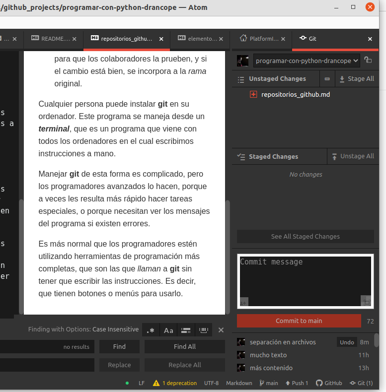

# Repositorios y **GitHub**

Un repositorio es una carpeta en la que guardamos un proyecto, normalmente programas, y que debe estar sincronizada entre nuestro ordenador y los ordenadores de otros colaboradores.

**GitHub** es un sitio de Internet, que permite guardar repositorios. Es uno de los más utilizados del mundo.

<a href="popup.html" onClick="return popup(this, 'Elementos')">my popup</a>

Para sincronizar el trabajo que se hace, se utiliza un programa, **git**, que nos obliga a trabajar de una manera especial:
- Creamos copias del repositorio original, bien para tener una copia de nuestra propiedad, o bien para hacer una copia desde Internet a nuestro ordenador.
- Modificamos el programa en el que estamos trabajando, en una **rama** distinta, para que no se mezcle con lo que ya estaba hecho antes, y creamos una "*solicitud de incorporación*" (*pull request*), para que los colaboradores la prueben, y si el cambio está bien, se incorpora a la *rama* original.

Cualquier persona puede instalar **git** en su ordenador. Este programa se maneja desde un ***terminal***, que es un programa que viene con todos los ordenadores en el cual escribimos instrucciones a mano.

Manejar **git** de esta forma es complicado, pero los programadores avanzados lo hacen, porque a veces les resulta más rápido hacer tareas especiales, o porque necesitan ver los mensajes del programa si existen errores.

Es más normal que los programadores estén utilizando herramientas de programación más completas, que son las que *llaman* a **git** sin tener que escribir las instrucciones. Es decir, que tienen botones o menús para usarlo.

